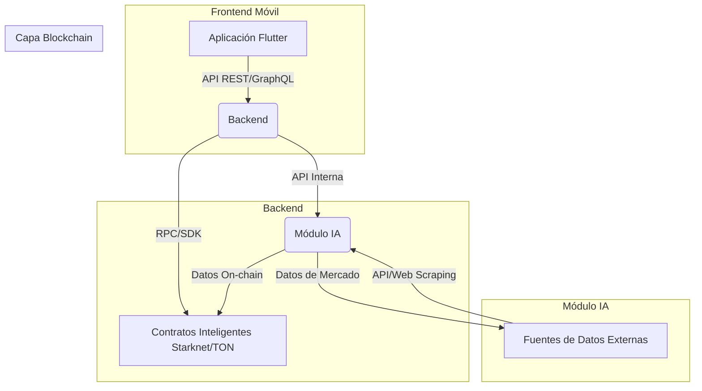

# Arquitectura Técnica Detallada: DeFi Advisor

## 1. Introducción

El proyecto **DeFi Advisor** es una aplicación móvil que actúa como un asesor financiero personalizado, impulsado por Inteligencia Artificial (IA), para el ecosistema de Finanzas Descentralizadas (DeFi). Su objetivo es analizar el perfil de riesgo del usuario, su actividad on-chain y las condiciones del mercado para recomendar estrategias óptimas de inversión, *staking*, *lending* y *yield farming* en protocolos basados en Starknet o TON. Este documento detalla la arquitectura técnica de la solución, describiendo sus componentes, las tecnologías utilizadas y cómo interactúan entre sí.

## 2. Visión General de la Arquitectura

La arquitectura de DeFi Advisor sigue un enfoque de microservicios y se divide en cuatro componentes principales, cada uno con responsabilidades claras y un stack tecnológico optimizado para su función:

*   **Frontend Móvil:** La interfaz de usuario principal, desarrollada con Flutter, que permite la interacción del usuario.
*   **Backend:** Un servicio central que orquesta las operaciones, agrega datos y expone APIs para el frontend y la IA. Se implementará en Rust o TypeScript.
*   **Módulo de Inteligencia Artificial (IA):** El componente encargado del análisis de datos, modelado de riesgo y generación de recomendaciones. Desarrollado en Python.
*   **Capa Blockchain:** La infraestructura descentralizada (Starknet o TON) donde residen los contratos inteligentes y se ejecutan las transacciones DeFi.

## 3. Componentes de la Arquitectura

### 3.1. Frontend Móvil

*   **Tecnología:** Flutter (Dart)
*   **Descripción:** La aplicación móvil es el punto de entrada para el usuario. Proporcionará una experiencia de usuario fluida y accesible en plataformas iOS y Android. Se encargará de:
    *   Mostrar el dashboard del portafolio del usuario.
    *   Presentar recomendaciones de estrategias DeFi generadas por la IA.
    *   Permitir la configuración del perfil de riesgo del usuario.
    *   Mostrar alertas de mercado y notificaciones.
    *   Facilitar la conexión segura con wallets Web3 para la ejecución de transacciones (a través del backend).
*   **Interacción:** Se comunicará con el Backend a través de APIs RESTful o GraphQL para obtener datos y enviar acciones del usuario.

### 3.2. Backend

*   **Tecnología:** Rust (Actix-web/Tokio) o TypeScript (Node.js)
*   **Descripción:** El backend es el corazón de la lógica de negocio del sistema. Sus responsabilidades incluyen:
    *   **Agregación de Datos:** Recopilar y procesar datos de diversos protocolos DeFi, oráculos de precios y la blockchain.
    *   **API Gateway:** Exponer APIs seguras para el frontend móvil y servir como punto de entrada para las solicitudes.
    *   **Integración Blockchain:** Interactuar con los contratos inteligentes en Starknet/TON para consultar estados, enviar transacciones y monitorear eventos.
    *   **Comunicación con IA:** Servir como intermediario entre el frontend y el módulo de IA, enviando datos de usuario y mercado, y recibiendo recomendaciones.
    *   **Gestión de Usuarios:** Autenticación, autorización y almacenamiento de perfiles de usuario (off-chain, si es necesario, o referencias a perfiles on-chain).
*   **Interacción:** Se comunicará con la Capa Blockchain mediante RPCs o SDKs específicos de Starknet/TON. Con el Módulo de IA, la comunicación será a través de APIs internas (REST/gRPC).

### 3.3. Módulo de Inteligencia Artificial (IA)

*   **Tecnología:** Python (Scikit-learn, Pandas, TensorFlow/PyTorch)
*   **Descripción:** Este módulo es el motor de inteligencia del DeFi Advisor. Sus funciones principales son:
    *   **Análisis de Datos de Mercado:** Procesar grandes volúmenes de datos históricos y en tiempo real de precios de activos, liquidez de pools, APYs de protocolos, etc.
    *   **Modelado de Perfil de Riesgo:** Evaluar la tolerancia al riesgo del usuario basándose en sus entradas y, potencialmente, en su historial de transacciones on-chain.
    *   **Algoritmos de Recomendación:** Desarrollar y entrenar modelos de Machine Learning para generar recomendaciones personalizadas de estrategias DeFi (staking, lending, yield farming) que se alineen con el perfil de riesgo del usuario y las condiciones actuales del mercado.
    *   **Detección de Anomalías/Alertas:** Identificar cambios significativos o riesgos potenciales en el mercado o en los protocolos DeFi para generar alertas.
*   **Interacción:** Recibirá datos del Backend y de fuentes de datos externas. Expondrá una API para que el Backend pueda solicitar análisis y recomendaciones.

### 3.4. Capa Blockchain (Starknet / TON)

*   **Tecnología:** Starknet (Cairo) o TON
*   **Descripción:** Esta capa es fundamental para la naturaleza descentralizada del proyecto. Albergará los contratos inteligentes que gestionarán aspectos clave como:
    *   **Perfiles de Usuario On-chain:** Almacenamiento de perfiles de riesgo o preferencias de usuario de forma descentralizada (opcional, dependiendo del diseño de privacidad).
    *   **Registro de Estrategias:** Posiblemente, un registro de estrategias recomendadas o ejecutadas.
    *   **Interacción con Protocolos DeFi:** Contratos que faciliten la interacción segura y eficiente con otros protocolos DeFi para ejecutar las estrategias recomendadas (ej. *swaps*, depósitos en *lending pools*).
*   **Interacción:** El Backend se comunicará con esta capa para leer estados de contratos, enviar transacciones firmadas por el usuario y monitorear eventos relevantes.

## 4. Flujo de Datos y Operaciones Clave

### 4.1. Configuración del Perfil de Riesgo

1.  El usuario interactúa con el Frontend Móvil para definir su tolerancia al riesgo y otros parámetros.
2.  El Frontend envía esta información al Backend.
3.  El Backend puede almacenar el perfil de riesgo en una base de datos o, si se decide, interactuar con un contrato inteligente en la Capa Blockchain para registrarlo on-chain.

### 4.2. Generación de Recomendaciones

1.  El Frontend solicita recomendaciones al Backend.
2.  El Backend recopila el perfil de riesgo del usuario (de su base de datos o de la blockchain) y los datos de mercado actuales (de fuentes externas y la blockchain).
3.  El Backend envía estos datos al Módulo de IA.
4.  El Módulo de IA procesa los datos y genera una lista de estrategias DeFi recomendadas.
5.  El Módulo de IA devuelve las recomendaciones al Backend.
6.  El Backend envía las recomendaciones al Frontend Móvil para su visualización.

### 4.3. Ejecución de Estrategias

1.  El usuario selecciona una estrategia recomendada en el Frontend Móvil.
2.  El Frontend envía la solicitud de ejecución al Backend.
3.  El Backend prepara la transacción necesaria para interactuar con el protocolo DeFi correspondiente en la Capa Blockchain.
4.  El Backend solicita al usuario que firme la transacción a través de su wallet Web3 conectada.
5.  Una vez firmada, el Backend envía la transacción a la Capa Blockchain para su ejecución.
6.  El Backend monitorea el estado de la transacción y notifica al Frontend sobre su resultado.

## 5. Consideraciones de Seguridad

*   **Contratos Inteligentes:** Auditorías de seguridad rigurosas, uso de patrones de diseño seguros y pruebas exhaustivas (unitarias, de integración, fuzzing).
*   **Backend:** Implementación de autenticación y autorización robustas, validación de entradas, protección contra ataques comunes (OWASP Top 10), gestión segura de claves API y credenciales.
*   **Frontend Móvil:** Almacenamiento seguro de datos sensibles, comunicación cifrada con el backend, protección contra ataques de ingeniería social.
*   **Privacidad:** Minimización de la recopilación de datos, anonimización cuando sea posible, cumplimiento de regulaciones de privacidad.

## 6. Escalabilidad y Rendimiento

*   **Blockchain:** La elección de Starknet o TON proporciona una base escalable con bajas comisiones, crucial para la viabilidad de un asesor DeFi.
*   **Backend:** Diseño de microservicios, uso de bases de datos escalables, caching y balanceo de carga para manejar un alto volumen de solicitudes.
*   **Módulo de IA:** Optimización de modelos, uso de infraestructuras de computación distribuida si es necesario, y APIs eficientes para la comunicación con el backend.

## 7. Futuras Mejoras

*   Integración con más blockchains y protocolos DeFi.
*   Funcionalidades avanzadas de simulación y optimización de portafolio.
*   Implementación de Machine Learning para la detección predictiva de riesgos.
*   Gobernanza descentralizada para la evolución del proyecto.

## 8. Referencias

[1] Propuesta de Proyecto #2: Asesor Financiero Descentralizado (DeFi Advisor) con IA y Enfoque Móvil.
