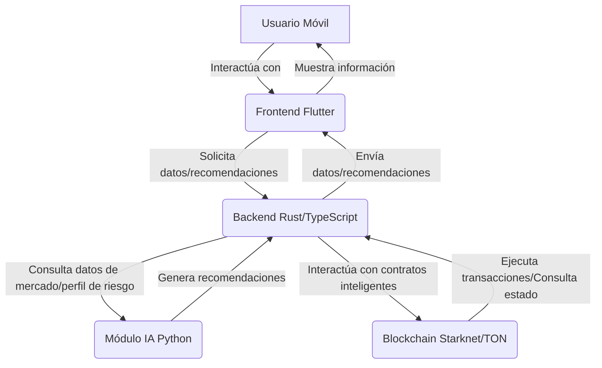

# DeFi Advisor: Asesor Financiero Descentralizado con IA y Enfoque Móvil

## Descripción del Proyecto

**DeFi Advisor** es una aplicación móvil innovadora que funciona como un asesor financiero personalizado, impulsado por Inteligencia Artificial (IA), diseñado específicamente para el ecosistema de Finanzas Descentralizadas (DeFi). La aplicación analiza el perfil de riesgo del usuario, su actividad on-chain y las condiciones actuales del mercado para ofrecer recomendaciones óptimas en estrategias de inversión, *staking*, *lending* y *yield farming* en protocolos basados en Starknet o TON, priorizando la eficiencia y las bajas comisiones.

El objetivo principal es democratizar el acceso a estrategias financieras sofisticadas en el espacio DeFi, simplificando la toma de decisiones y personalizando las recomendaciones para usuarios de todos los niveles de experiencia. La integración con Starknet o TON aprovecha sus ventajas de escalabilidad y menores costos de transacción, haciendo las estrategias DeFi más accesibles y rentables.

## Arquitectura del Proyecto

La arquitectura de DeFi Advisor se compone de cuatro componentes principales, cada uno con un stack tecnológico específico para maximizar la eficiencia y la escalabilidad:

*   **Blockchain (Starknet/TON):** La capa fundamental para la interacción con contratos inteligentes y la ejecución de transacciones. Se utilizará Cairo para el desarrollo de contratos en Starknet.
*   **Backend (Rust/TypeScript):** Actúa como el puente entre el frontend, el módulo de IA y la blockchain. Es responsable de la agregación de datos de diferentes protocolos DeFi y la exposición de APIs para la IA y el frontend.
*   **Inteligencia Artificial (Python):** El cerebro del asesor. Este módulo se encarga del análisis de datos de mercado, el modelado de riesgo del usuario y la generación de algoritmos de recomendación personalizados utilizando librerías como Scikit-learn y Pandas.
*   **Frontend/Mobile (Flutter):** La interfaz de usuario accesible y fluida para iOS y Android. Permite a los usuarios interactuar con el asesor, visualizar su portafolio, recibir recomendaciones y gestionar alertas.



## Configuración del Entorno de Desarrollo

Para configurar el entorno de desarrollo, siga los pasos para cada componente:

### Blockchain (Starknet/Cairo)

1.  **Instalar Scarb:** Siga las instrucciones en la [documentación oficial de Scarb](https://docs.swmansion.com/scarb/download.html).
2.  **Instalar Starknet-devnet (opcional, para desarrollo local):**
    ```bash
    pip install starknet-devnet
    ```

### Backend (Rust)

1.  **Instalar Rust:** Siga las instrucciones en [rustup.rs](https://rustup.rs/).
2.  **Navegar al directorio `defi-advisor/backend`:**
    ```bash
    cd defi-advisor/backend
    ```
3.  **Compilar y ejecutar:**
    ```bash
    cargo run
    ```

### Inteligencia Artificial (Python)

1.  **Instalar Python 3.9+:** Asegúrese de tener una versión compatible de Python.
2.  **Crear y activar un entorno virtual:**
    ```bash
    python3 -m venv venv
    source venv/bin/activate
    ```
3.  **Instalar dependencias:**
    ```bash
    pip install -r requirements.txt
    ```
4.  **Ejecutar el módulo de IA (para pruebas):**
    ```bash
    python main.py
    ```

### Frontend/Mobile (Flutter)

1.  **Instalar Flutter SDK:** Siga las instrucciones en la [documentación oficial de Flutter](https://flutter.dev/docs/get-started/install).
2.  **Navegar al directorio `defi-advisor/mobile`:**
    ```bash
    cd defi-advisor/mobile
    ```
3.  **Obtener dependencias:**
    ```bash
    flutter pub get
    ```
4.  **Ejecutar la aplicación:**
    ```bash
    flutter run
    ```

## Roadmap

Consulte el archivo `ROADMAP.md` para obtener una visión detallada de las fases del proyecto y los hitos.

## Contribución

Para contribuir al proyecto, por favor, siga las siguientes directrices:

*   **Issues:** Utilice las plantillas de Issues para reportar errores o sugerir nuevas características.
*   **Pull Requests:** Siga las plantillas de Pull Request para enviar sus contribuciones.

## Licencia

Este proyecto está bajo la Licencia MIT. Consulte el archivo `LICENSE` para más detalles.

## Contacto

Para preguntas o comentarios, por favor, contacte a [Tu Nombre/Email/GitHub].

## SDK (TypeScript)

El SDK de DeFi Advisor permite a otros desarrolladores integrar fácilmente las funcionalidades principales del proyecto en sus aplicaciones. Proporciona métodos para consultar estrategias DeFi, analizar el riesgo del usuario y obtener recomendaciones personalizadas.

### Instalación

```bash
npm install defi-advisor-sdk
```

### Uso

```typescript
import DefiAdvisorSDK from 'defi-advisor-sdk';

const sdk = new DefiAdvisorSDK('https://api.defi-advisor.com'); // Reemplaza con la URL de tu API

async function main() {
  try {
    // Consultar estrategias DeFi
    const strategies = await sdk.getStrategies();
    console.log('Estrategias DeFi:', strategies);

    // Analizar riesgo de un usuario
    const userAddress = '0x123...'; // Dirección de ejemplo
    const riskAnalysis = await sdk.analyzeRisk(userAddress);
    console.log('Análisis de riesgo:', riskAnalysis);

    // Obtener recomendaciones para un usuario
    const recommendations = await sdk.getRecommendations(userAddress);
    console.log('Recomendaciones:', recommendations);
  } catch (error) {
    console.error('Error al usar el SDK:', error);
  }
}

main();
```

### Métodos Disponibles

*   `constructor(baseUrl: string)`: Inicializa el SDK con la URL base de la API.
*   `getStrategies(): Promise<Strategy[]>`: Obtiene una lista de estrategias DeFi disponibles.
*   `analyzeRisk(userAddress: string): Promise<RiskAnalysis>`: Realiza un análisis de riesgo para una dirección de usuario específica.
*   `getRecommendations(userAddress: string): Promise<Recommendation[]>`: Obtiene recomendaciones personalizadas para una dirección de usuario.

### Tipos de Datos

```typescript
interface Strategy {
  id: string;
  name: string;
  description: string;
  apy: number;
  riskLevel: 'low' | 'medium' | 'high';
  protocols: string[];
}

interface RiskAnalysis {
  userProfile: string;
  riskScore: number;
  recommendations: string[];
}

interface Recommendation {
  strategyId: string;
  reason: string;
  expectedReturn: number;
}
```
